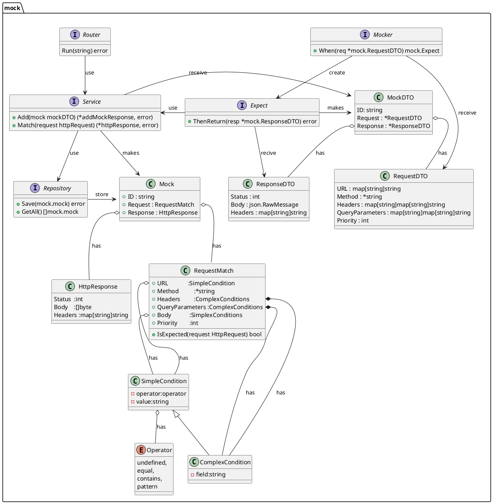

### Source

```puml
@startuml

interface mock.Router {
	Run(string) error
}

interface mock.Service {
    +Add(mock mockDTO) (*addMockResponse, error)
    +Match(request httpRequest) (*httpResponse, error)
}

interface mock.Repository {
+Save(mock.mock) error
+GetAll() []mock.mock
}

interface mock.Mocker {
   +When(req *mock.RequestDTO) mock.Expect
}

interface mock.Expect {
   +ThenReturn(resp *mock.ResponseDTO) error
}

class mock.MockDTO{
    ID: string
    Request : *RequestDTO
    Response : *ResponseDTO
}

class mock.RequestDTO{
    URL : map[string]string
    Method : *string
    Headers : map[string]map[string]string
    QueryParameters : map[string]map[string]string
    Priority : int
}

class mock.ResponseDTO{
    Status : int
    Body : json.RawMessage
    Headers : map[string]string
}

class mock.Mock{
+ID : string
+Request : RequestMatch
+Response : HttpResponse
}

class mock.HttpResponse{
    Status  :int
    Body    :[]byte
    Headers :map[string]string
}

class mock.RequestMatch {
    +URL             :SimpleCondition
    +Method          :*string
    +Headers         :ComplexConditions
    +QueryParameters :ComplexConditions
    +Body            :SimplexConditions
    +Priority        :int
    +IsExpected(request HttpRequest) bool
}

class mock.SimpleCondition{
    -operator:operator
    -value:string
}

class mock.ComplexCondition extends mock.SimpleCondition{
    -field:string
}

enum mock.Operator{
    undefined,
    equal,
    contains,
    pattern
}


mock.Router -down-> mock.Service :use
mock.Service -down-> mock.Repository : use
mock.Service -> mock.MockDTO : receive
mock.Service -> mock.Mock : makes
mock.Mocker -down-> mock.Expect : create
mock.Repository -> mock.Mock : store
mock.Mocker -> mock.RequestDTO : receive
mock.Expect -> mock.ResponseDTO : recive
mock.Expect -> mock.MockDTO : makes
mock.Expect -> mock.Service : use
mock.MockDTO::Request o-- mock.RequestDTO : has
mock.MockDTO::Response o-- mock.ResponseDTO : has
mock.SimpleCondition o-- mock.Operator : has
mock.RequestMatch::Headers *-- mock.ComplexCondition : has
mock.RequestMatch::QueryParameters *-- mock.ComplexCondition : has
mock.RequestMatch::URL o-- mock.SimpleCondition : has
mock.RequestMatch::Body o-- mock.SimpleCondition : has
mock.Mock::Request o-- mock.RequestMatch : has
mock.Mock::Response o-- mock.HttpResponse : has

@enduml
```

